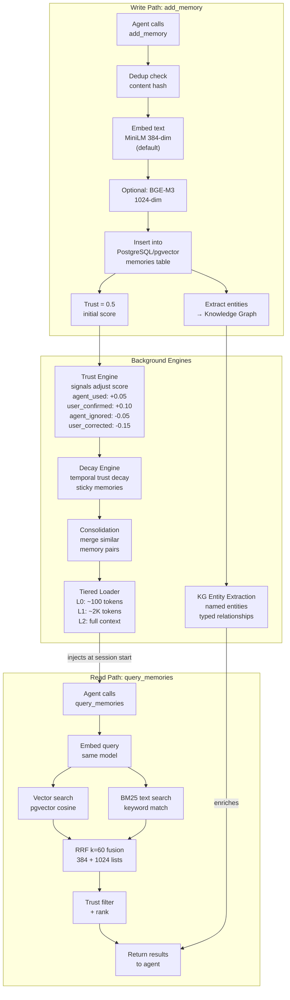

# Architecture

memini-ai is a local-first semantic memory server built on PostgreSQL +
pgvector, exposed over MCP stdio via FastMCP. The design favors a single
long-running process per machine, a strict separation between storage and
reasoning layers, and opt-in advanced features so a solo install never pays
for capabilities it does not use.

For version history and release notes, see [CHANGELOG.md](CHANGELOG.md).

## Components

### FastMCP server (`server.py`)

The entry point. `memini-ai --stdio` boots a FastMCP server that registers
all 52 MCP tools and dispatches calls into the memory, knowledge-graph,
trust, tiered-loader, dialectic, decay, multi-peer, and thought-chain
subsystems. The server is protocol-only - it does not own business logic.

### PostgreSQL + pgvector

The storage layer. Two backends are supported:

- **`pgembed`** (default since v1.0.0): an in-process PostgreSQL 17 with
  pgvector + vectorscale + pg_textsearch. No Docker required. One embedded
  Postgres is shared by all memini-ai processes on the same machine via a
  cooperative heartbeat protocol (1s ping, 2s timeout, 5s drain grace).
- **`postgres-external`** (legacy v0.8.x): any PostgreSQL 16+ with pgvector.
  Selected by setting `MEMINI_VECTOR_BACKEND=postgres-external` and
  `MEMINI_DB_URL`.

The schema stores memories in a `memories` table with two vector columns:

```sql
CREATE TABLE memories (
    id UUID PRIMARY KEY,
    text TEXT NOT NULL,
    embedding vector(384),          -- MiniLM-L6-v2 (384-dim, default)
    embedding_bge_m3 vector(1024),  -- BGE-M3 (1024-dim, optional GPU upgrade)
    ...
);
```

A `memories_image` table (v0.8.0) holds 768-dim CLIP embeddings for memories
with associated images, and a `memories_1024` table holds elevated 384-dim
memories that were promoted into 1024-dim space.

### Embedding models (`model/`)

Two models are supported:

| Model | Dim | Use case |
|-------|-----|----------|
| `sentence-transformers/all-MiniLM-L6-v2` | 384 | Fast, CPU-friendly, default |
| `BAAI/bge-m3` | 1024 | Higher precision, multi-lingual, GPU-friendly |

`ModelManager` is a singleton that lazy-loads the configured model on first
use. Short aliases (`minilm`, `bge-m3`) are accepted. `MEMINI_AUTO_DETECT_MODEL`
defaults to `true` so new deployments with 0 memories auto-upgrade to BGE-M3.

### Dual-model RRF (`memory/rrf.py`)

When `MEMINI_ENABLE_RRF=true` (or `MEMINI_EMBEDDING_MODE=auto`), queries fan
out to both the 384-dim and 1024-dim columns and fuse the two ranked lists
using **Reciprocal Rank Fusion** (k=60, Cormack SIGIR 2009):

```text
score(d) = sum over models of 1 / (k + rank_in_model(d))
```

A memory appearing in both lists gets both contributions summed - the natural
boost for cross-model agreement. The image-recall RRF arm (v0.8.0) adds a
third fan-out using CLIP over the `memories_image` table when
`MEMINI_IMAGE_SEARCH_ENABLED=true`.

### Indexer (`indexer/`)

The project indexer walks a directory tree, chunks files with overlap,
embeds each chunk, and writes rows tagged with `source_type='project'`.
An inotify watcher re-indexes changed files. State is persisted in a
SQLite tracker so restarts are cheap.

### Tiered loader (`tiered_loader.py`)

Generates three summary tiers from the memory store:

- **L0** (~100 tokens): high-trust memories only. Injected at session start.
- **L1** (~2K tokens): trust >= 0.8. Used for planning tasks.
- **L2** (full context): all memories. Used for deep research.

### Trust engine (`trust_engine.py`)

Every memory starts at trust 0.5. Signals adjust the score:

| Signal | Delta |
|--------|-------|
| `agent_used` | +0.05 |
| `user_confirmed` | +0.10 |
| `agent_ignored` | -0.05 |
| `user_corrected` | -0.15 |

Memories below `MEMINI_TRUST_THRESHOLD_ARCHIVE` (default 0.2) are archived.
Memories above `MEMINI_TRUST_THRESHOLD_PROMOTE` (default 0.8) are promoted
into L1.

### Decay engine (`decay.py`)

When `MEMINI_DECAY_ENABLED=true`, temporal trust decay runs on a schedule and
lowers the trust of memories that have not been used recently. Per-memory
decay rates can be tuned via `adjust_decay_rate` (sticky = low rate).

### Knowledge graph (`graph.py`, `knowledge_graph.py`, `entity_extractor.py`)

When `MEMINI_KG_ENABLED=true`, the entity extractor pulls named entities out
of new memories, the graph stores typed relationships between entities, and
`query_kg` answers formal queries. A live D3.js visualization is available
via `get_graph_visualization`.

### Dialectic (`dialectic.py`)

When `MEMINI_DIALECTIC_ENABLED=true`, `find_contradictions` detects memory
pairs that semantically conflict and `resolve_contradiction` asks an LLM to
synthesize a resolution that is stored back as a new memory linked to both
parents via `DERIVED_FROM` relationships.

### Multi-peer (`multi_peer.py`)

When `MEMINI_MULTI_PEER_ENABLED=true`, memories are tagged with a `peer_id`
and can be explicitly shared with another peer via `share_memory`. Per-project
enforcement is opt-in via `MEMINI_PEER_ENFORCEMENT=true`.

### Thought chains (`thought_chains.py`)

When `THOUGHT_CHAINS=true`, agents can persist multi-step reasoning chains
that survive across sessions. Chains support branching (`branch_thought`),
revision (`revise_thought`), and abandonment. Each thought is also stored as
a regular memory so semantic search surfaces them naturally.

## Memory lifecycle

<!-- mermaid: memory-lifecycle -->


## Python API

memini-ai can also be used as a library without MCP:

```python
import asyncio
from memini_ai.memory.system import MemorySystem
from memini_ai.memory.schema import MemoryEntry, MemorySourceType, SearchOptions, SearchStrategy

async def main():
    system = MemorySystem()
    await system.initialize()

    entry = MemoryEntry(
        text="Python list comprehension tutorial",
        source_type=MemorySourceType.session,
    )
    memory_id = await system.add_memory(entry)

    options = SearchOptions(topK=10, strategy=SearchStrategy.TIERED)
    results = await system.query_memories("list comprehension", options)
    for r in results:
        print(r.text, r.trust_score)

asyncio.run(main())
```

## Source layout

```text
memini_ai/
├── config.py            # Env var + JSON config
├── server.py            # FastMCP server (52 tools)
├── api/                 # FastAPI KG visualization + D3 template
├── audit/               # Audit logger
├── decay.py             # Temporal trust decay
├── dialectic.py         # Contradiction detection + resolution
├── entity_extractor.py  # Named entity extraction
├── extractor.py         # Auto-extraction from conversations
├── graph.py             # Knowledge graph storage
├── indexer/             # Project indexer (chunker, watcher, tracker)
├── knowledge_graph.py   # KG query layer
├── llm/                 # LLM base + factory + ollama + openai_compat
├── memory/              # Database, RRF, schema, search, system
├── model/               # Embeddings + ModelManager
├── multi_peer.py        # Peer-to-peer sharing
├── postgres/            # PostgresDatabase + driver + queries + schema
├── precompress.py       # Pre-compression extraction
├── rate_limiter.py      # Rate limiting
├── thought_chains.py    # Persistent reasoning chains
├── tiered_loader.py     # L0/L1/L2 summaries
├── trust_engine.py      # Trust scoring + archive/promote
├── user_model.py        # User profile + style tracking
└── utils/               # hash, logger, sanitizer
```